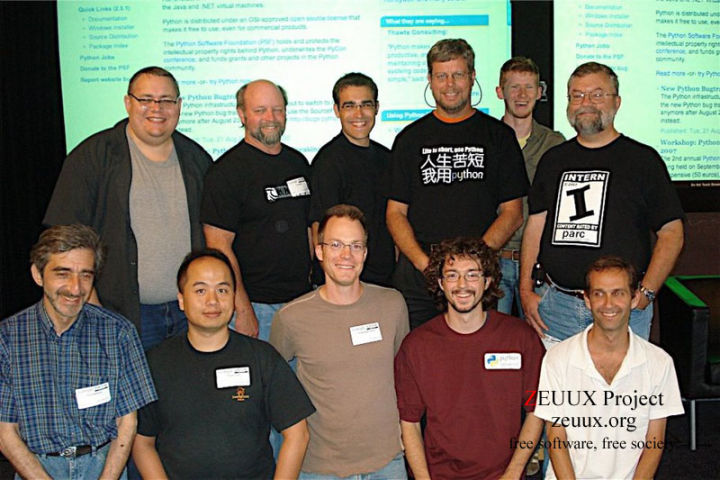
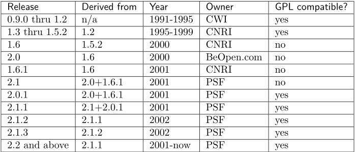
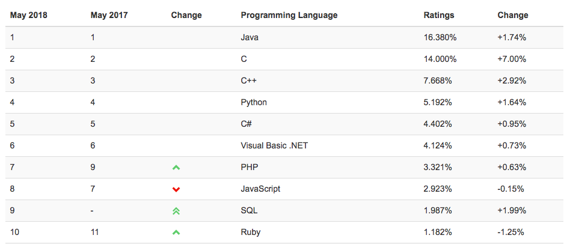
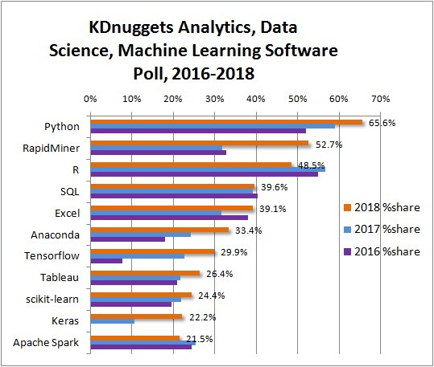
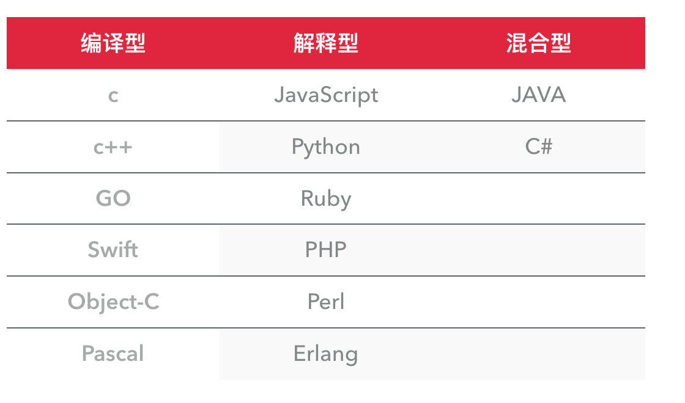
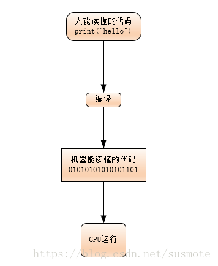
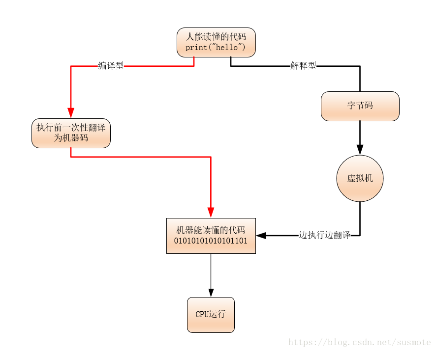
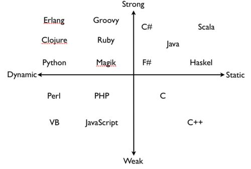

[TOC]

# 第一章：Python的介绍

首先用一句业内非常出名的话来介绍Python

  

***“Life is short, you need Python ”***

> 中文也就是人生苦短，我用python

这也是Python宣传时经常说的一句话

从这句话中，可以非常清楚Python他到底优点在哪里，为什么要去学Python  

### 1.Python的发展历程

Python是在1990年被***Guido van Rossum(吉多·范罗苏姆)***创建发明，1989年的圣诞节期间，吉多·范罗苏姆为了在阿姆斯特丹打发时间，决心开发一个新的脚本解释程序，作为ABC语言的一种继承。    

  

  

Python的名字来源于python创造者看的BBC的一部剧“Monty Python’s Flying Circus”

Python英文翻译过来是蟒蛇的意思

Python前期版本的发展过程如下

  

Python 已经成为最受欢迎的程序设计语言之一。2011年1月，它被TIOBE编程语言排行榜评为2010年度语言。自从2004年以后，python的使用率呈线性增长

  

*由于Python语言的简洁性、易读性以及可扩展性，在国外用Python做科学计算的研究机构日益增多，一些知名大学已经采用Python来教授程序设计课程。例如卡耐基梅隆大学的编程基础、麻省理工学院的计算机科学及编程导论就使用Python语言讲授。众多开源的科学计算软件包都提供了Python的调用接口，例如著名的计算机视觉库OpenCV、三维可视化库VTK、医学图像处理库ITK。而Python专用的科学计算扩展库就更多了，例如如下3个十分经典的科学计算扩展库：NumPy、SciPy和matplotlib，它们分别为Python提供了快速数组处理、数值运算以及绘图功能。因此Python语言及其众多的扩展库所构成的开发环境十分适合工程技术、科研人员处理实验数据、制作图表，甚至开发科学计算应用程序。*   

如下图，数据科学的编程语言排行榜，可以看到python名列前茅

  

  

  

### 2.Python的应用  

> Python可以应用于众多领域，如：数据分析、组件集成、网络服务、图像处理、数值计算和科学计算等众多领域。目前业内几乎所有大中型互联网企业都在使用Python，如：Youtube、Dropbox、BT、Quora（中国知乎）、豆瓣、知乎、Google、Yahoo!、Facebook、NASA、百度、腾讯、汽车之家、美团等。

##### 目前Python应用的主要领域

- 云计算: 云计算最火的语言， 典型应用OpenStack
- WEB开发: 众多优秀的WEB框架，众多大型网站均为Python开发，Youtube, Dropbox, 豆瓣。。。， 典型WEB框架有Django
- 科学运算、人工智能: 典型库NumPy, SciPy, Matplotlib, Enthought librarys,pandas
- 系统运维: 运维人员必备语言
- 金融：量化交易，金融分析，在金融工程领域，Python不但在用，且用的最多，而且重要性逐年提高。原因：作为动态语言的Python，语言结构清晰简单，库丰富，成熟稳定，科学计算和统计分析都很牛逼，生产效率远远高于c,c++,java,尤其擅长策略回测
- 图形GUI: PyQT, WxPython,TkInter  

  

##### Python在一些公司的应用

- Reddit - 社交分享网站，最早用Lisp开发，在2005年转为python

- Dropbox - 文件分享服务
- 豆瓣网 - 图书、唱片、电影等文化产品的资料数据库网站
- Django - 鼓励快速开发的Web应用框架
- Fabric - 用于管理成百上千台Linux主机的程序库
- EVE - 网络游戏EVE大量使用Python进行开发
- Blender - 以C与Python开发的开源3D绘图软件
- BitTorrent - bt下载软件客户端
- Ubuntu Software Center - Ubuntu 9.10版本后自带的图形化包管理器
- YUM - 用于RPM兼容的Linux系统上的包管理器
- Civilization IV - 游戏《文明4》
- Battlefield 2 - 游戏《战地2》
- Google - 谷歌在很多项目中用python作为网络应用的后端，如Google Groups、Gmail、Google Maps等，Google App Engine支持python作为开发语言
- NASA - 美国宇航局，从1994年起把python作为主要开发语言
- Industrial Light & Magic - 工业光魔，乔治·卢卡斯创立的电影特效公司
- Yahoo! Groups - 雅虎推出的群组交流平台
- YouTube - 视频分享网站，在某些功能上使用到python
- Cinema 4D - 一套整合3D模型、动画与绘图的高级三维绘图软件，以其高速的运算和强大的渲染插件著称
- Autodesk Maya - 3D建模软件，支持python作为脚本语言
- gedit - Linux平台的文本编辑器
- GIMP - Linux平台的图像处理软件
- Minecraft: Pi Edition - 游戏《Minecraft》的树莓派版本
- MySQL Workbench - 可视化数据库管理工具
- Digg - 社交新闻分享网站
- Mozilla - 为支持和领导开源的Mozilla项目而设立的一个非营利组织
- Quora - 社交问答网站

- Path - 私密社交应用
- Pinterest - 图片社交分享网站
- SlideShare - 幻灯片存储、展示、分享的网站
- Yelp - 美国商户点评网站
- Slide - 社交游戏/应用开发公司，被谷歌收购  

  

### 3.Python的风格

> *Python在设计上坚持了清晰划一的风格，这使得Python成为一门易读、易维护，并且被大量用户所欢迎的、用途广泛的语言。*

  

设计者开发时总的指导思想是，对于一个特定的问题，只要有一种最好的方法来解决就好了。这在由Tim Peters写的Python格言（称为The Zen of Python）里面表述为：There should be one-- and preferably only one --obvious way to do it. 这正好和Perl语言（另一种功能类似的高级动态语言）的中心思想TMTOWTDI（There's More Than One Way To Do It）完全相反。  

  

Python的作者有意的设计限制性很强的语法，使得不好的编程习惯（例如if语句的下一行不向右缩进）都不能通过编译。其中很重要的一项就是Python的缩进规则。  

  

一个和其他大多数语言（如C）的区别就是，一个模块的界限，完全是由每行的首字符在这一行的位置来决定的（而C语言是用一对花括号{}来明确的定出模块的边界的，与字符的位置毫无关系）。这一点曾经引起过争议。因为自从C这类的语言诞生后，语言的语法含义与字符的排列方式分离开来，曾经被认为是一种程序语言的进步。不过不可否认的是，通过强制程序员们缩进（包括if，for和函数定义等所有需要使用模块的地方），Python确实使得程序更加清晰和美观。  

  

##### Python是一门解释型语言

编程语言主要从以下几个角度为进行分类，编译型和解释型、静态语言和动态语言、强类型定义语言和弱类型定义语言，每个分类代表什么意思呢，我们一起来看一下。  

  

###### 编译型语言和解释型语言

  

传统意义上的所谓编译与解释，区别在于代码是在什么时候被翻译成目标CPU的指令。——虽然这种解释从科学上说不通，但这却是一直以来大家更认可的更约定俗成的定义。  

  

对 C 语言或者其他编译型语言来说，编译生成了目标文件，而这个目标文件是针对特定的 CPU 体系的，为 ARM 生成的目标文件，不能被用于 MIPS 的 CPU。这段代码在编译过程中就已经被翻译成了目标 CPU 指令，所以，如果这个程序需要在另外一种 CPU 上面运行，这个代码就必须重新编译。  

  

对于各种非编译型语言（例如python/java）来说，同样也可能存在某种编译过程，但他们编译生成的通常是一种『平台无关』的中间代码，这种代码一般不是针对特定的 CPU 平台，他们是在运行过程中才被翻译成目标 CPU 指令的，因而，在 ARM CPU 上能执行，换到 MIPS 也能执行，换到 X86 也能执行，不需要重新对源代码进行编译。

  

至于为什么会有虚拟机的存在？这个答案也很简单了，因为那些非编译型语言生成的并不是目标平台的代码，而是某种中间代码。而能够运行这种中间代码的机器并不广泛存在，所以我们在每个不同的平台中用软件模拟出这个假想平台的虚拟机，这个虚拟机执行这种中间代码，而虚拟机负责把代码转换成最终的目标平台上的指令。  

  

用两张图来表示就很清楚了

  

  

  

  

###### 静态语言和动态语言  

> 通常我们所说的动态语言、静态语言是指动态类型语言和静态类型语言。

 

1. 动态类型语言：动态类型语言是指在运行期间才去做数据类型检查的语言，也就是说，在用动态类型的语言编程时，永远也不用给任何变量指定数据类型，该语言会在你第一次赋值给变量时，在内部将数据类型记录下来。Python和Ruby就是一种典型的动态类型语言，其他的各种脚本语言如VBScript也多少属于动态类型语言。
2. 静态类型语言：静态类型语言与动态类型语言刚好相反，它的数据类型是在编译其间检查的，也就是说在写程序时要声明所有变量的数据类型，C/C++是静态类型语言的典型代表，其他的静态类型语言还有C#、JAVA等。  

  

  

###### 强类型定义语言和弱类型定义语言  

首先我用一张图来说明哪些是强类型语言，哪些是弱类型语言，以及动态和静态语言的分类  

  

1. 强类型定义语言：强制数据类型定义的语言。也就是说，一旦一个变量被指定了某个数据类型，如果不经过强制转换，那么它就永远是这个数据类型了。举个例子：如果你定义了一个整型变量a,那么程序根本不可能将a当作字符串类型处理。强类型定义语言是类型安全的语言。
2. 弱类型定义语言：数据类型可以被忽略的语言。它与强类型定义语言相反, 一个变量可以赋不同数据类型的值。

  

强类型定义语言在速度上可能略逊色于弱类型定义语言，但是强类型定义语言带来的严谨性能够有效的避免许多错误。另外，“这门语言是不是动态语言”与“这门语言是否类型安全”之间是完全没有联系的！  

  

例如：Python是动态语言，是强类型定义语言（类型安全的语言）; VBScript是动态语言，是弱类型定义语言（类型不安全的语言）; JAVA是静态语言，是强类型定义语言（类型安全的语言）。 

 

> *后续我们讲到Python的数据类型就会很清楚了*

  

​    

### 4.Python的优点与缺点  

##### 优点

- 简单：Python是一种代表简单主义思想的语言。阅读一个良好的Python程序就感觉像是在读英语一样。它使你能够专注于解决问题而不是去搞明白语言本身。
- 易学：Python极其容易上手，因为Python有极其简单的说明文档 。
- 速度快：Python 的底层是用 C 语言写的，很多标准库和第三方库也都是用 C 写的，运行速度非常快。
- 免费、开源：Python是FLOSS（自由/开放源码软件）之一。使用者可以自由地发布这个软件的拷贝、阅读它的源代码、对它做改动、把它的一部分用于新的自由软件中。FLOSS是基于一个团体分享知识的概念。
- 高层语言：用Python语言编写程序的时候无需考虑诸如如何管理你的程序使用的内存一类的底层细节。
- 可移植性：由于它的开源本质，Python已经被移植在许多平台上（经过改动使它能够工作在不同平台上）。这些平台包括Linux、Windows、FreeBSD、Macintosh、Solaris、OS/2、Amiga、AROS、AS/400、BeOS、OS/390、z/OS、Palm OS、QNX、VMS、Psion、Acom RISC OS、VxWorks、PlayStation、Sharp Zaurus、Windows CE、PocketPC、Symbian以及Google基于linux开发的android平台。
- 解释性：一个用编译性语言比如C或C++写的程序可以从源文件（即C或C++语言）转换到一个你的计算机使用的语言（二进制代码，即0和1）。
  - 这个过程通过编译器和不同的标记、选项完成。 运行程序的时候，连接/转载器软件把你的程序从硬盘复制到内存中并且运行。
  - 而Python语言写的程序不需要编译成二进制代码。你可以直接从源代码运行 程序。 
  - 在计算机内部，Python解释器把源代码转换成称为字节码的中间形式，然后再把它翻译成计算机使用的机器语言并运行。这使得使用Python更加简单。也使得Python程序更加易于移植。
- 面向对象：Python既支持面向过程的编程也支持面向对象的编程。在“面向过程”的语言中，程序是由过程或仅仅是可重用代码的函数构建起来的。在“面向对象”的语言中，程序是由数据和功能组合而成的对象构建起来的。
- 可扩展性：如果需要一段关键代码运行得更快或者希望某些算法不公开，可以部分程序用C或C++编写，然后在Python程序中使用它们。
- 可嵌入性：可以把Python嵌入C/C++程序，从而向程序用户提供脚本功能。
- 丰富的库：Python标准库确实很庞大。它可以帮助处理各种工作，包括正则表达式、文档生成、单元测试、线程、数据库、网页浏览器、CGI、FTP、电子邮件、XML、XML-RPC、HTML、WAV文件、密码系统、GUI（图形用户界面）、Tk和其他与系统有关的操作。这被称作Python的“功能齐全”理念。除了标准库以外，还有许多其他高质量的库，如wxPython、Twisted和Python图像库等等。
- 规范的代码：Python采用强制缩进的方式使得代码具有较好可读性。而Python语言写的程序不需要编译成二进制代码。

  

   

##### 缺点

- 单行语句和命令行输出问题：很多时候不能将程序连写成一行，如import sys;for i in sys.path:print i。而perl和awk就无此限制，可以较为方便的在shell下完成简单程序，不需要如Python一样，必须将程序写入一个.py文件。
- 独特的语法：这也许不应该被称为局限，但是它用缩进来区分语句关系的方式还是给很多初学者带来了困惑。即便是很有经验的Python程序员，也可能陷入陷阱当中。
- 运行速度慢：这里是指与C和C++相比。  

  

  

### 5.Python的版本

- Python 1.0 - January 1994 增加了 lambda, map, filter and reduce.
- Python 2.0 - October 16, 2000，加入了内存回收机制，构成了现在Python语言框架的基础
- Python 2.4 - November 30, 2004, 同年目前最流行的WEB框架Django 诞生
- Python 2.5 - September 19, 2006
- Python 2.6 - October 1, 2008
- Python 2.7 - July 3, 2010
- In November 2014, it was announced that Python 2.7 would be supported until 2020, and reaffirmed that there would be no 2.8 release as users were expected to move to Python 3.4+ as soon as possible
- Python 3.0 - December 3, 2008
- Python 3.1 - June 27, 2009
- Python 3.2 - February 20, 2011
- Python 3.3 - September 29, 2012
- Python 3.4 - March 16, 2014
- Python 3.5 - September 13, 2015
- python 3.6 - December 23,2016
- python 3.7.0 beta -  Janurary 31,2018 

  

**2017年，该语言作者在邮件列表上宣布 Python 2.7将于2020年1月1日终止支持。用户如果想要在这个日期之后继续得到与Python 2.7有关的支持，则需要付费给商业供应商。**

> 有一个网站专门记录Python2.7将会在多久后，不被支持 https://pythonclock.org/
>
> 

 

# 第二章:Python的开发环境配置

